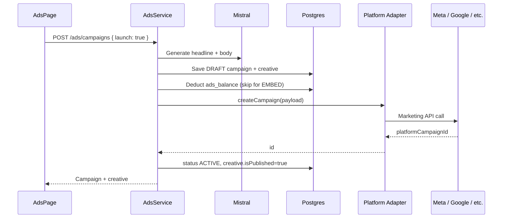

# Ads Module

AI-generated ad campaigns with balance-based billing, multi-platform publishing, and self-hosted embed ads.

**UI:** `/ads` in the dashboard  
**API base:** `/api/v1/ads`  
**Public embed (no auth):** `/embed-ads/*`

---

## Table of contents

1. [Overview](#overview)
2. [Architecture](#architecture)
3. [Environment variables](#environment-variables)
4. [Platform setup guides](#platform-setup-guides)
5. [API reference](#api-reference)
6. [User flows](#user-flows)
7. [Embed (self-hosted) ads](#embed-self-hosted-ads)
8. [Payments & ads balance](#payments--ads-balance)
9. [Admin settings](#admin-settings)
10. [Production checklist](#production-checklist)
11. [Troubleshooting](#troubleshooting)

---

## Overview

| Feature | Description |
|---------|-------------|
| **AI copy** | Mistral generates headline + body on campaign create |
| **AI assist** | Wizard “Magic Fill” suggests name, audience, location, age range |
| **Balance ledger** | `tenants.ads_balance` (ZMW); charged on **publish**, not draft |
| **Embed ads** | Free self-hosted banner widget with impression/click tracking |
| **Refund on failure** | If platform publish fails, balance is restored and status → `FAILED` |

### Supported platforms

| Platform | Code | OAuth via Publisher Connect | Extra server env |
|----------|------|----------------------------|------------------|
| Facebook & Instagram | `META` | Facebook (`ads_management` scope) | `META_AD_ACCOUNT_ID` (optional) |
| Google Ads | `GOOGLE` | Google | `GOOGLE_ADS_DEVELOPER_TOKEN`, `GOOGLE_ADS_CUSTOMER_ID` |
| TikTok Ads | `TIKTOK` | TikTok | `TIKTOK_ADVERTISER_ID` |
| LinkedIn Ads | `LINKEDIN` | LinkedIn | `LINKEDIN_AD_ACCOUNT_ID` (optional) |
| Pinterest Ads | `PINTEREST` | — | `PINTEREST_ADS_ACCESS_TOKEN`, `PINTEREST_AD_ACCOUNT_ID` |
| Taboola | `TABOOLA` | — | `TABOOLA_CLIENT_ID`, `TABOOLA_CLIENT_SECRET`, `TABOOLA_ACCOUNT_ID` |
| X (Twitter) Ads | `X` | — (env token) | `X_ADS_ACCOUNT_ID`, `X_ADS_ACCESS_TOKEN` |
| Website embed | `EMBED` | — | `API_PUBLIC_URL` only |

Enable/disable platforms in **Admin → System Settings** (`enabled_ad_platforms`).

---

## Architecture



### Key files

| Path | Role |
|------|------|
| `src/modules/ads/services/ads.service.ts` | Business logic, balance, AI |
| `src/modules/ads/services/ads-account.service.ts` | OAuth token resolution from `social_accounts` |
| `src/modules/ads/adapters/*.ts` | Per-platform Marketing API integrations |
| `src/modules/ads/embed-ads.controller.ts` | Public widget + click redirect |
| `resources/client/src/pages/AdsPage.tsx` | Dashboard |
| `resources/client/src/pages/CreateCampaignSheet.tsx` | 3-step wizard |

### Campaign statuses

| Status | Meaning |
|--------|---------|
| `DRAFT` | Created with AI copy; not yet live (balance not charged) |
| `ACTIVE` | Published to platform (or embed serving) |
| `PAUSED` | Paused via API or embed adapter |
| `FAILED` | Publish failed; balance refunded if charged |
| `COMPLETED` | Reserved for future end-of-flight automation |

---

## Environment variables

Add these to `.env` (see the **Ads Module** section in your `.env` file).

### Shared

| Variable | Required | Description |
|----------|----------|-------------|
| `API_PUBLIC_URL` | **Yes** (prod) | Public API origin for embed script + click URLs. Example: `https://mako.tekreminnovations.com` |
| `MISTRAL_API_KEY` | **Yes** | AI copy generation (already used by Brand Brain) |
| `PAYMENTS_DEV_AUTO_COMPLETE` | Dev only | `true` auto-credits ads top-ups without mobile money prompt |

### Meta (Facebook & Instagram)

| Variable | Required | Description |
|----------|----------|-------------|
| `FACEBOOK_APP_ID` | **Yes** | Same Meta app as Publisher Connect |
| `FACEBOOK_APP_SECRET` | **Yes** | Same Meta app |
| `META_AD_ACCOUNT_ID` | No | Format `act_123456789`. Auto-discovered via Graph `/me/adaccounts` if omitted |

**Publisher Connect:** Connect **Facebook** with `ads_management` and `ads_read` scopes (included in publisher OAuth).

### Google Ads

| Variable | Required | Description |
|----------|----------|-------------|
| `GOOGLE_CLIENT_ID` | **Yes** | OAuth client (already in `.env`) |
| `GOOGLE_CLIENT_SECRET` | **Yes** | OAuth client secret |
| `GOOGLE_ADS_DEVELOPER_TOKEN` | **Yes** | From [Google Ads API Center](https://ads.google.com/aw/apicenter) |
| `GOOGLE_ADS_CUSTOMER_ID` | **Yes** | 10-digit Ads customer ID, no dashes |

**Publisher Connect:** Connect **Google** so refresh tokens are stored in `social_accounts`.

### TikTok Ads

| Variable | Required | Description |
|----------|----------|-------------|
| `TIKTOK_CLIENT_KEY` | **Yes** | TikTok app (already in `.env`) |
| `TIKTOK_CLIENT_SECRET` | **Yes** | TikTok app secret |
| `TIKTOK_ADVERTISER_ID` | **Yes** | Advertiser ID from TikTok Ads Manager |

**Publisher Connect:** Connect **TikTok** for Marketing API access token.

### LinkedIn Ads

| Variable | Required | Description |
|----------|----------|-------------|
| `LINKEDIN_CLIENT_ID` | **Yes** | LinkedIn app (already in `.env`) |
| `LINKEDIN_CLIENT_SECRET` | **Yes** | LinkedIn app secret |
| `LINKEDIN_AD_ACCOUNT_ID` | No | Sponsored account ID; can live in `social_accounts.metadata.sponsored_account_id` |

**Publisher Connect:** Connect **LinkedIn**. Marketing API may require partner approval.

### Pinterest Ads

| Variable | Required | Description |
|----------|----------|-------------|
| `PINTEREST_ADS_ACCESS_TOKEN` | **Yes** | Ads API v5 bearer token |
| `PINTEREST_AD_ACCOUNT_ID` | **Yes** | Ad account ID from Pinterest Ads Manager |

No Publisher Connect OAuth for Pinterest yet — server token only.

### Taboola

| Variable | Required | Description |
|----------|----------|-------------|
| `TABOOLA_CLIENT_ID` | **Yes** | Backstage API client ID |
| `TABOOLA_CLIENT_SECRET` | **Yes** | Backstage API client secret |
| `TABOOLA_ACCOUNT_ID` | **Yes** | Taboola account slug (e.g. `yourbrand-network`) |

### X (Twitter) Ads

| Variable | Required | Description |
|----------|----------|-------------|
| `X_ADS_ACCOUNT_ID` | **Yes** | Ads account ID from X Ads Manager |
| `X_ADS_ACCESS_TOKEN` | **Yes** | Ads API bearer token |
| `X_ADS_FUNDING_INSTRUMENT_ID` | No | Billing instrument for campaign creation |

---

## Platform setup guides

### 1. Meta (Facebook & Instagram)

1. **Meta Developer Console** → your app → **App Review** → request `ads_management`, `ads_read`.
2. **Publisher Connect** → connect Facebook for the workspace.
3. Ensure the connected user has access to a Meta ad account in [Business Manager](https://business.facebook.com/).
4. Optionally set `META_AD_ACCOUNT_ID=act_XXXXXXXXX`.
5. Create a test campaign on `/ads` with platform **Facebook & Instagram**.

Campaigns are created **PAUSED** on Meta until you activate them in Ads Manager (safe default).

### 2. Google Ads

1. Apply for a **Developer Token** at [Google Ads API Center](https://ads.google.com/aw/apicenter).
2. Note your **Customer ID** (top-right in Ads UI).
3. Set `GOOGLE_ADS_DEVELOPER_TOKEN` and `GOOGLE_ADS_CUSTOMER_ID`.
4. **Publisher Connect** → connect Google (stores refresh token).
5. Launch a campaign from `/ads`.

### 3. TikTok Ads

1. [TikTok for Business](https://ads.tiktok.com/) → create advertiser account.
2. Copy **Advertiser ID** → `TIKTOK_ADVERTISER_ID`.
3. TikTok Developer Portal → enable **Marketing API** for your app.
4. **Publisher Connect** → connect TikTok.
5. Launch from `/ads`.

### 4. LinkedIn Ads

1. Apply for [LinkedIn Marketing API](https://learn.microsoft.com/en-us/linkedin/marketing/) access if required.
2. Connect LinkedIn in **Publisher Connect**.
3. Set `LINKEDIN_AD_ACCOUNT_ID` or store `sponsored_account_id` in account metadata.
4. Launch from `/ads`.

### 5. Pinterest Ads

1. [Pinterest Developers](https://developers.pinterest.com/) → create app → Ads API access.
2. Generate access token with ads scopes.
3. Set `PINTEREST_ADS_ACCESS_TOKEN` and `PINTEREST_AD_ACCOUNT_ID`.

### 6. Taboola

1. [Taboola Backstage](https://www.taboola.com/) → API credentials.
2. Set `TABOOLA_CLIENT_ID`, `TABOOLA_CLIENT_SECRET`, `TABOOLA_ACCOUNT_ID`.

### 7. X (Twitter) Ads

1. [X Developer Portal](https://developer.x.com/) → Ads API access (approval required).
2. Create ads account + funding instrument in Ads Manager.
3. Set `X_ADS_ACCOUNT_ID`, `X_ADS_ACCESS_TOKEN`, optionally `X_ADS_FUNDING_INSTRUMENT_ID`.

### 8. Embed (no external API)

1. No OAuth or paid balance required.
2. Set `API_PUBLIC_URL` to your public API domain.
3. Create campaign → platform **Embed on Website** → provide **Target URL**.
4. After launch, click **Copy Embed Code** on `/ads`.
5. Paste the `<script>` tag on any website page.

---

## API reference

All routes require `Authorization: Bearer <jwt>` except embed routes.

### Campaigns

| Method | Path | Description |
|--------|------|-------------|
| `POST` | `/api/v1/ads/campaigns` | Create draft; pass `"launch": true` to create + publish |
| `POST` | `/api/v1/ads/campaigns/:id/publish` | Publish draft (`{ "tenantId": "..." }`) |
| `POST` | `/api/v1/ads/campaigns/:id/pause` | Pause active campaign |
| `GET` | `/api/v1/ads/campaigns?tenantId=` | List campaigns with creatives |
| `GET` | `/api/v1/ads/campaigns/:id/metrics?tenantId=` | Platform metrics (spend, impressions, clicks) |
| `GET` | `/api/v1/ads/campaigns/:id/embed-script?tenantId=` | Embed snippet (EMBED only) |

### Balance & stats

| Method | Path | Description |
|--------|------|-------------|
| `GET` | `/api/v1/ads/balance?tenantId=` | Current `ads_balance` (ZMW) |
| `GET` | `/api/v1/ads/dashboard-stats?tenantId=` | `{ activeCampaigns, totalSpend, totalImpressions }` |
| `POST` | `/api/v1/ads/ai-assist` | AI wizard fill `{ tenantId, prompt, platform? }` |

### Payments (ads top-up)

| Method | Path | Description |
|--------|------|-------------|
| `POST` | `/api/v1/payments/ads-deposit` | `{ tenantId, amount, phone?, correspondent? }` |

On completion, `tenants.ads_balance` increases. Plan code: `ADS_TOPUP`.

### Public embed (no auth)

| Method | Path | Description |
|--------|------|-------------|
| `GET` | `/embed-ads/widget/:platformCampaignId.js` | Serves banner JS; increments impressions |
| `GET` | `/embed-ads/click/:platformCampaignId` | Tracks click; redirects to `targetUrl` |

Only **ACTIVE** campaigns serve the widget.

### Example: create and launch

```bash
curl -X POST "$API_PUBLIC_URL/api/v1/ads/campaigns" \
  -H "Authorization: Bearer $TOKEN" \
  -H "Content-Type: application/json" \
  -d '{
    "tenantId": "uuid",
    "name": "Summer Sale",
    "platform": "EMBED",
    "dailyBudget": 0,
    "targetAudience": "Shoppers in Lusaka",
    "prompt": "Flash sale on running shoes",
    "targetUrl": "https://example.com/sale",
    "launch": true
  }'
```

---

## User flows

### Top up balance

1. `/ads` → **Top Up**
2. Enter amount (ZMW) + mobile money number
3. `POST /api/v1/payments/ads-deposit`
4. Dev: auto-completes when `PAYMENTS_DEV_AUTO_COMPLETE=true`
5. Prod: approve MoMo prompt; webhook `POST /api/v1/payments/webhooks/deposit` credits balance

### Create & launch campaign

1. **Create Campaign** → 3-step wizard (AI assist optional)
2. **Pay & Launch** → `POST /campaigns` with `launch: true`
3. AI generates copy → draft saved → balance checked → platform API called
4. Success → `ACTIVE`; failure → `FAILED` + refund

### Manage campaigns

- **DRAFT** → **Publish** button (manual publish if created without `launch`)
- **ACTIVE** → **Pause**, **Metrics**, **Copy Embed Code** (EMBED only)
- Dashboard cards show live stats from `GET /dashboard-stats`

---

## Embed (self-hosted) ads

### How it works

1. Server generates `platformCampaignId` like `widget_abc123…`
2. Widget URL: `{API_PUBLIC_URL}/embed-ads/widget/{id}.js`
3. Click tracking: `{API_PUBLIC_URL}/embed-ads/click/{id}` → `targetUrl`

### Snippet (from API)

```html
<script src="https://mako.tekreminnovations.com/embed-ads/widget/widget_abc123.js" async></script>
```

Get the exact snippet via `GET /api/v1/ads/campaigns/:id/embed-script`.

### Notes

- No balance charge for EMBED campaigns
- Widget only serves when status is `ACTIVE`
- Impressions/clicks stored in `ad_campaigns.native_impressions` / `native_clicks`

---

## Payments & ads balance

| Concept | Implementation |
|---------|----------------|
| Currency | ZMW (Zambian Kwacha) |
| Storage | `tenants.ads_balance` (`numeric(10,2)`) |
| Charge timing | On **publish** (not draft) |
| Cost formula | `dailyBudget × durationDays` (min 1 day); EMBED = 0 |
| Deposit plan | `ADS_TOPUP` in `deposits` table |
| Refund | SQL increment on publish failure |

---

## Admin settings

**Path:** `/admin/system` → System Settings

| Key | Type | Description |
|-----|------|-------------|
| `enabled_ad_platforms` | `{ platforms: string[] }` | Controls which platforms appear in the create wizard |

Default platforms: `META`, `GOOGLE`, `TIKTOK`, `LINKEDIN`, `PINTEREST`, `TABOOLA`, `X`, `EMBED`.

---

## Production checklist

- [ ] `API_PUBLIC_URL=https://your-production-domain` (no trailing slash)
- [ ] Run migrations: `yarn migrations:run` (ads tables + `ads_balance`)
- [ ] `PAYMENTS_DEV_AUTO_COMPLETE=false` in production
- [ ] PawaPay webhook registered: `{API_PUBLIC_URL}/api/v1/payments/webhooks/deposit`
- [ ] Meta app: `ads_management` approved; Facebook connected per tenant
- [ ] Google Ads developer token approved (can take days)
- [ ] Per-platform env vars set for platforms you enable in admin
- [ ] Test EMBED flow first (no external API dependency)
- [ ] Deploy: `yarn deploy:prod`

---

## Troubleshooting

| Error | Cause | Fix |
|-------|-------|-----|
| `Connect your facebook account in Publisher Connect` | No OAuth token | Publisher Connect → Facebook |
| `Insufficient ads balance` | `ads_balance` too low | Top up on `/ads` |
| `GOOGLE_ADS_DEVELOPER_TOKEN is not configured` | Missing env | Set token from API Center |
| `No Meta ad account found` | User lacks ad account access | Business Manager → assign ad account, or set `META_AD_ACCOUNT_ID` |
| `Failed to publish campaign: ...` | Platform API rejected request | Check adapter logs; campaign → `FAILED`, balance refunded |
| Embed 404 / inactive | Campaign not `ACTIVE` | Publish campaign first |
| Wrong embed domain | `API_PUBLIC_URL` mismatch | Set to production API URL |
| TikTok `advertiser_id` invalid | Wrong ID | Use Ads Manager advertiser ID, not Login Kit open id |

### Logs

Server logs include adapter names (`MetaAdsAdapter`, `GoogleAdsAdapter`, etc.) on create/pause.

### Database

| Table | Purpose |
|-------|---------|
| `ad_campaigns` | Campaign config, status, native metrics |
| `ad_creatives` | Headline, body, publish flags |
| `tenants.ads_balance` | Prepaid ads wallet |

---

## Related docs

- [Social auth & Publisher Connect](./social-auth.md)
- [Deploy](./DEPLOY.md)
- [CI/CD](./CI_CD.md)
